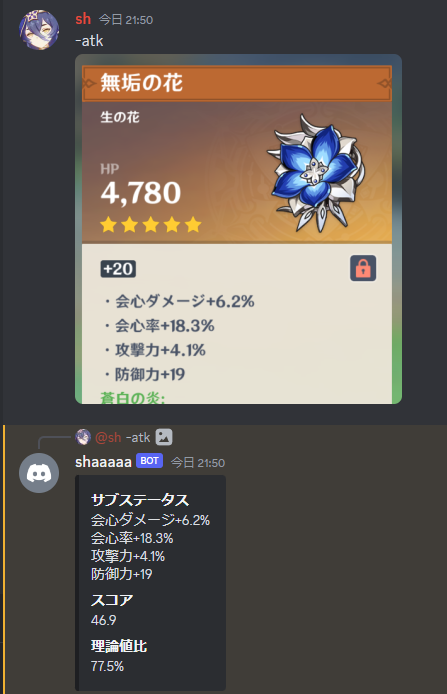
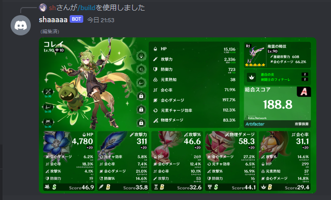

## 動かし方
Debian(wsl1), python 3.11.1で動作確認
```bash
cd genshin-discord-bot
# tesseract-ocrをインストール
# 使いたい言語のあれ(tesseract-ocr-jpnとか)もインストールする
sudo apt install tesseract-ocr tesseract-ocr-jpn
# venv(やらなくてもいい)
python -m venv venv
source venv/bin/activate.fish
# パッケージのインストール
pip install -r requirements.txt
# 設定ファイル
vim config.py
```
config.pyの中身
```python
token = 'ここにtoken'
prefix = '-'
```

## 機能
### 画像からスコアを計算する

|コマンド||
|-|-|
|crit|会心率\*2 + 会心ダメージ|
|atk|会心率\*2 + 会心ダメージ + 攻撃力%|
|hp|会心率\*2 + 会心ダメージ + HP%|
|def|会心率\*2 + 会心ダメージ + 防御力%|
|em|会心率\*2 + 会心ダメージ + 元素熟知\*0.25|
|er|会心率\*2 + 会心ダメージ + 元素チャージ効率|

### ビルドカード作成
[FuroBath/ArtifacterImageGen](https://github.com/FuroBath/ArtifacterImageGen)を[ちょっと改良したやつ](https://github.com/shaaaaaQ/ArtifacterImageGen)をつかって画像を生成

|コマンド|
|-|
|build \<UID>|