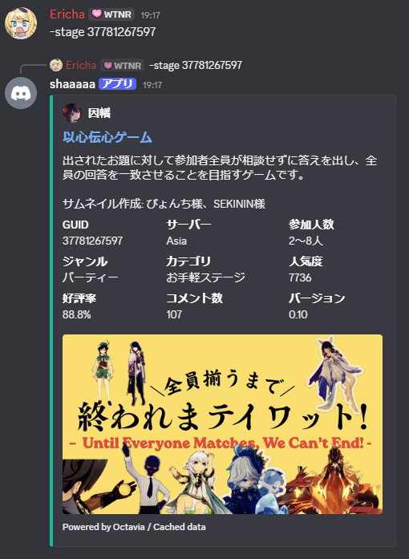
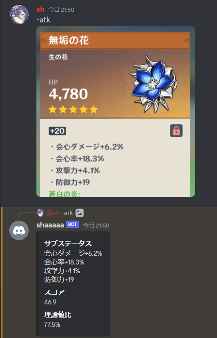
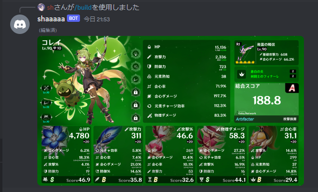

## 動かし方
```bash
cd genshin-discord-bot

# venv(やらなくてもいい)
python -m venv venv
source venv/bin/activate.fish

# パッケージのインストール
pip install -r requirements.txt

# 設定ファイル
cp .env.example .env
vim .env

# 実行
python main.py
```

もしくはDocker

## TODO
bot
- レート制限
- forgetuid コマンドでuidを削除できるように

## 機能

### 幻境のステージ情報


[Octavia API](https://github.com/kj415j45/octavia) から、幻境の情報を取得して表示します。

|コマンド|例（prefix が `-` の場合）|
|-|-|
|stage \<GUID> [サーバー]|`-stage 29191333005`|
|サーバーを指定|`-stage 29191333005 os_asia`|

指定可能なサーバー: `os_asia`, `os_usa`, `os_euro`, `os_cht`, `cn_gf01`, `cn_qd01`

### 画像からスコアを計算する

|コマンド||
|-|-|
|crit|会心率\*2 + 会心ダメージ|
|atk|会心率\*2 + 会心ダメージ + 攻撃力%|
|hp|会心率\*2 + 会心ダメージ + HP%|
|def|会心率\*2 + 会心ダメージ + 防御力%|
|em|会心率\*2 + 会心ダメージ + 元素熟知\*0.25|
|er|会心率\*2 + 会心ダメージ + 元素チャージ効率|

### ビルドカード作成
[enka.py](https://github.com/seriaati/enka-py) でショーケースを取得し、
[ArtifacterImageGen](https://github.com/shaaaaaQ/ArtifacterImageGen) で画像を生成

|コマンド|
|-|
|build [UID]|

### プロフィール表示

|コマンド|
|-|
|profile [UID]|

`build` と `profile` で指定したUIDはDiscordユーザーごとに保存され、次回から省略できます。

### 交換コード一覧

[hoyoverse-api](https://github.com/torikushiii/hoyoverse-api) から、現在利用できる原神の交換コードと報酬を取得して表示します。

|コマンド|例（prefix が `-` の場合）|
|-|-|
|codes|`-codes`|
|codesnotify status|`-codesnotify`|
|codesnotify set \<チャンネル>|`-codesnotify set #交換コード`|
|codesnotify remove|`-codesnotify remove`|

サーバー管理者だけが `codesnotify` で通知先を設定・確認・削除できます。通知先を設定すると、15分おきに交換コードを確認し、
新しいコードが追加されたときだけ通知します。`status` で現在の通知先を確認し、`remove` で通知を解除できます。

### ガチャ情報

[hoyoverse-api](https://github.com/torikushiii/hoyoverse-api) から、現在の原神のキャラクター祈願・武器祈願と開催期間を日本語で取得して表示します。

|コマンド|例（prefix が `-` の場合）|
|-|-|
|gacha|`-gacha`|

### ゲーム内イベント

[hoyoverse-api](https://github.com/torikushiii/hoyoverse-api) から、現在の原神のゲーム内イベント・開催期間・主な報酬を日本語で取得して表示します。

|コマンド|例（prefix が `-` の場合）|
|-|-|
|events|`-events`|

## ライセンス

本リポジトリの独自コードは、特記のない限り[Unlicense](LICENSE)で提供されます。

依存ライブラリには、それぞれのライセンスが適用されます。

下記ライブラリはGPLv3で提供されており、結合したプログラム全体の配布にはGPLv3が適用されます。([COPYING.GPLv3](COPYING.GPLv3))
- [enka-py](https://github.com/seriaati/enka-py)


## 免責事項
本プロジェクトは非公式のファンプロジェクトです。
HoYoverseおよびCOGNOSPHEREとの提携・承認・後援関係はありません。原神および関連する名称、画像、その他の素材に関する権利は、それぞれの権利者に帰属します。
これらの第三者に帰属する名称、画像、その他の素材は、本リポジトリのライセンス対象には含まれません。
